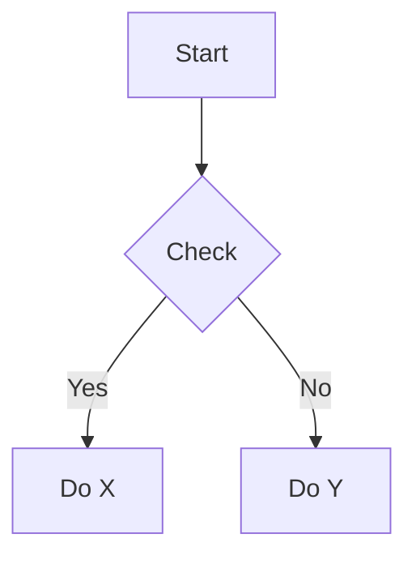

# Brilliant Visualizer

An AI agent skill that analyzes article content and automatically generates matching illustrations — diagrams, architecture charts, AI images, stock photos, and infographics.

## Why

Writing a good article is half the job. The other half is finding or creating the right visuals for each section. This skill does the second half: it reads your article, identifies where illustrations would help, picks the best generation method for each, and produces them.

It works as a standalone command or as a pipeline stage between [great-writer](https://github.com/d-wwei/great-writer) (writing) and [typeset](https://github.com/d-wwei/typeset) (formatting).

## Quick Start

1. Copy the skill to your Claude Code skills directory:

```bash
cp -r brilliant-visualizer ~/.claude/skills/
```

2. Use it:

```
/visualize path/to/article.md
```

3. Review the illustration plan, confirm, and let it generate.

## How It Works

Two steps: **Analyze → Generate**.

**Step 1 — Analyze.** The skill scans your article and produces an illustration plan:

| # | Location | Type | Engine | Description | Priority |
|---|----------|------|--------|-------------|----------|
| 1 | After title | Cover | ai-image | Tech-style concept art | Required |
| 2 | After §2 | Architecture | mermaid | Microservice topology | Required |
| 3 | After §5 | Comparison | html-render | Performance metrics | Suggested |

You can edit, remove, or add entries before proceeding.

**Step 2 — Generate.** For each confirmed entry, the skill loads the right engine, generates the visual, and inserts it into your Markdown.

## Engines

| Engine | What it does | Tool needed |
|--------|-------------|-------------|
| **mermaid** | Flowcharts, sequence diagrams, ER diagrams, state charts, gantt, mindmaps, pie charts | `@mermaid-js/mermaid-cli` (optional — inline code works without it) |
| **architecture** | System architecture, network topology, component diagrams | `d2` (preferred) or `graphviz` |
| **ai-image** | Concept art, cover images, abstract illustrations | OpenAI API / local Flux2 / nanobanana |
| **stock-photo** | Real-world scenes, people, environments | Unsplash API / Pexels API / web search |
| **html-render** | Data comparisons, stat cards, bar charts, timelines | gstack browse (headless Chromium) |

Engines are loaded on demand. If you only need Mermaid diagrams, the skill never reads the AI image module.

## Output

Diagrams (Mermaid) are inserted as inline code blocks by default:

````markdown

````

Images (AI-generated, stock photos, HTML renders) are saved to `./images/` and referenced in Markdown:

```markdown

```

Stock photos include source attribution as HTML comments.

## Configuration

All settings use environment variables:

```bash
# AI image backend priority (comma-separated)
VISUALIZE_AI_BACKEND=flux2,gpt-image-1,dall-e-3,nanobanana

# Local Flux2 endpoint
VISUALIZE_FLUX2_URL=http://192.168.x.x:port/api/generate

# OpenAI (for DALL-E 3 and gpt-image-1)
OPENAI_API_KEY=sk-xxx

# nanobanana
NANOBANANA_API_KEY=xxx

# Stock photo APIs (optional — falls back to web search)
UNSPLASH_ACCESS_KEY=xxx
PEXELS_API_KEY=xxx

# Image output directory (default: ./images/)
VISUALIZE_OUTPUT_DIR=./images

# Mermaid output: "inline" (default) or "render" (PNG)
VISUALIZE_MERMAID_MODE=inline
```

No API keys? The skill still works — Mermaid and HTML rendering need no keys, and stock photo search falls back to web search.

## Integration

**With great-writer:** After drafting, great-writer can invoke `/visualize` to add illustrations before the review phase.

```
Research → Draft → [Visualize] → Review → Humanize → Finalize
```

**With typeset:** The output Markdown (with Mermaid blocks and image references) is ready for typeset to render into platform-specific HTML.

## File Structure

```
brilliant-visualizer/
  SKILL.md              — Main entry: workflow + routing logic
  engines/
    mermaid.md          — 7 Mermaid diagram types with templates
    architecture.md     — D2, Graphviz, Mermaid fallback
    ai-image.md         — Multi-backend routing + prompt engineering
    stock-photo.md      — Unsplash/Pexels API + web search fallback
    html-render.md      — HTML templates + screenshot via headless browser
```

## Tool Installation

Install only what you need:

```bash
# Mermaid CLI (for rendering to PNG/SVG)
npm install -g @mermaid-js/mermaid-cli

# D2 (for architecture diagrams)
brew install d2

# Graphviz (alternative to D2)
brew install graphviz
```

Mermaid inline mode and HTML rendering work without installing anything.

## License

MIT
