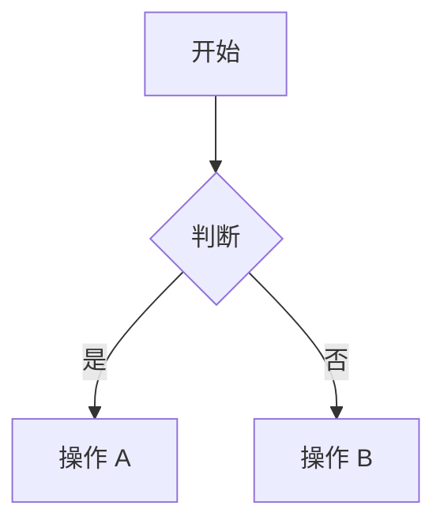

# Brilliant Visualizer

一个 AI Agent Skill，分析文章内容后自动生成配图——流程图、架构图、AI 生成图、图库搜索、信息图，全都能搞定。

## 为什么需要它

写好一篇文章只是一半的工作，另一半是给每个章节找到或生成合适的配图。这个 skill 负责后半段：读你的文章，识别哪里需要配图，为每个位置选择最佳生成方式，然后自动生成。

它可以独立使用，也可以作为写作工具链的中间环节，衔接 [great-writer](https://github.com/d-wwei/great-writer)（写作）和 [typeset](https://github.com/d-wwei/typeset)（排版）。兼容所有支持 Skill 的 AI Agent——Claude Code、Codex、Gemini CLI 等。

## 快速开始

1. 将 skill 复制到你的 Agent 技能目录：

```bash
# Claude Code
cp -r brilliant-visualizer ~/.claude/skills/

# Codex / 其他 Agent
cp -r brilliant-visualizer ~/.agents/skills/
```

2. 使用：

```
visualize path/to/article.md
```

3. 查看配图方案，确认后自动生成。

## 工作流程

两步走：**分析 → 生成**。

**第一步——分析。** Skill 扫描文章，输出配图方案表：

| # | 位置 | 类型 | 引擎 | 描述 | 优先级 |
|---|------|------|------|------|--------|
| 1 | 标题后 | 封面图 | ai-image | 科技感概念图 | 必要 |
| 2 | §2 后 | 架构图 | mermaid | 微服务拓扑 | 必要 |
| 3 | §5 后 | 对比图 | html-render | 性能指标对比 | 建议 |

你可以修改、删除或新增条目。

**第二步——生成。** 按确认后的方案逐个生成，插入到 Markdown 中。

## 引擎

| 引擎 | 能做什么 | 需要的工具 |
|------|---------|-----------|
| **mermaid** | 流程图、时序图、ER 图、状态图、甘特图、思维导图、饼图 | `@mermaid-js/mermaid-cli`（可选，内联代码不需要） |
| **architecture** | 系统架构图、网络拓扑、组件图 | `d2`（推荐）或 `graphviz` |
| **ai-image** | 概念图、封面图、抽象插画 | OpenAI API / 本地 Flux2 / nanobanana |
| **stock-photo** | 真实场景、人物、环境 | Unsplash API / Pexels API / 搜索引擎 |
| **html-render** | 数据对比、指标卡片、柱状图、时间线 | 任意无头浏览器（Puppeteer、Playwright 等） |

引擎按需加载。如果只用到 Mermaid，不会加载 AI 图片模块。

## 输出格式

图表类（Mermaid）默认内联为代码块：

````markdown

````

图片类（AI 生成、图库、HTML 渲染）保存到 `./images/` 目录：

```markdown

```

图库图片自动附带来源标注。

## 配置

通过环境变量配置：

```bash
# AI 图片后端优先级（逗号分隔）
VISUALIZE_AI_BACKEND=flux2,gpt-image-1,dall-e-3,nanobanana

# 本地 Flux2 地址
VISUALIZE_FLUX2_URL=http://192.168.x.x:port/api/generate

# OpenAI（DALL-E 3 和 gpt-image-1）
OPENAI_API_KEY=sk-xxx

# nanobanana
NANOBANANA_API_KEY=xxx

# 图库 API（可选，没有会 fallback 到搜索引擎）
UNSPLASH_ACCESS_KEY=xxx
PEXELS_API_KEY=xxx

# 图片输出目录（默认 ./images/）
VISUALIZE_OUTPUT_DIR=./images

# Mermaid 输出模式："inline"（默认）或 "render"（渲染为 PNG）
VISUALIZE_MERMAID_MODE=inline
```

没有 API key 也能用——Mermaid 和 HTML 渲染不需要 key，图库搜索自动降级到搜索引擎。

## 集成

**与 great-writer 集成：** 初稿完成后，great-writer 可调用 `visualize` 添加配图。

```
Research → Draft → [Visualize] → Review → Humanize → Finalize
```

**与 typeset 衔接：** 输出的 Markdown（含 Mermaid 代码块和图片引用）可直接交给 typeset 渲染为各平台格式的 HTML。

## 文件结构

```
brilliant-visualizer/
  SKILL.md              — 主入口：工作流 + 路由逻辑
  engines/
    mermaid.md          — 7 种 Mermaid 图表类型 + 模板
    architecture.md     — D2、Graphviz、Mermaid 兜底
    ai-image.md         — 多后端路由 + prompt 工程
    stock-photo.md      — Unsplash/Pexels API + 搜索引擎降级
    html-render.md      — HTML 模板 + 无头浏览器截图
```

## 安装工具

按需安装：

```bash
# Mermaid CLI（渲染为 PNG/SVG 时需要）
npm install -g @mermaid-js/mermaid-cli

# D2（架构图）
brew install d2

# Graphviz（D2 的替代）
brew install graphviz
```

Mermaid 内联模式和 HTML 渲染不需要安装任何工具。

## 许可证

MIT
