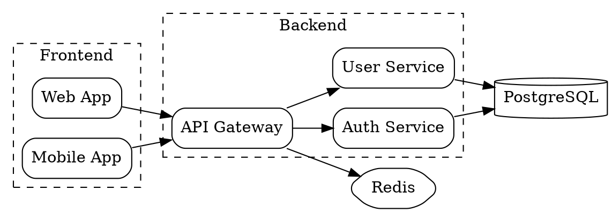
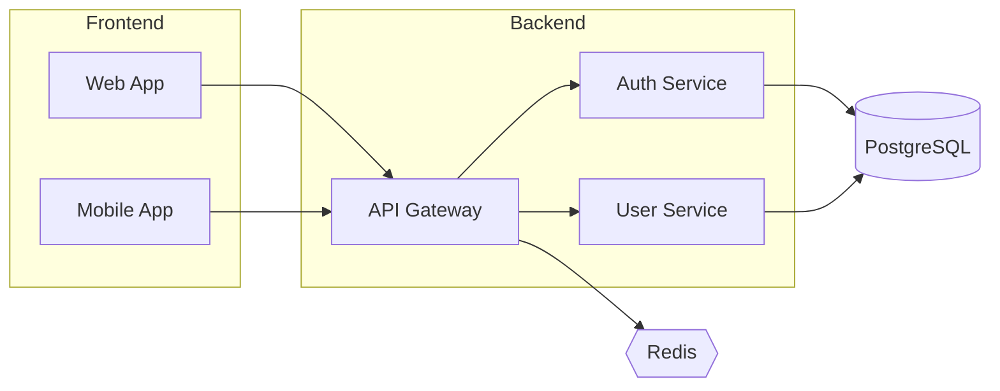

# 架构图引擎

从文章中的系统架构、组件关系、网络拓扑描述生成架构图。

## 工具优先级

```
D2 (推荐) → Graphviz (备选) → Mermaid graph (兜底)
```

## 安装

```bash
# D2 (推荐，现代语法，输出美观)
brew install d2

# Graphviz (经典，广泛支持)
brew install graphviz
```

都没装时，fallback 到 Mermaid graph (不需要额外安装)。

---

## D2 引擎

### 基本语法

```d2
# 节点
server: Web Server
db: Database {
  shape: cylinder
}
cache: Redis Cache {
  shape: hexagon
}

# 连接
server -> db: SQL queries
server -> cache: Read/Write
cache -> db: Cache miss {
  style.stroke-dash: 3
}
```

### 常用 shape

| Shape | 用途 |
|-------|------|
| rectangle (默认) | 服务、模块 |
| cylinder | 数据库 |
| hexagon | 缓存、中间件 |
| cloud | 外部服务 |
| oval | 起止节点 |
| queue | 消息队列 |
| package | 包/容器 |

### 分组 (容器)

```d2
backend: Backend Services {
  api: API Gateway
  auth: Auth Service
  user: User Service

  api -> auth
  api -> user
}

frontend: Frontend {
  web: Web App
  mobile: Mobile App
}

frontend.web -> backend.api: HTTPS
frontend.mobile -> backend.api: HTTPS
```

### 渲染命令

```bash
# SVG (推荐，可缩放)
d2 input.d2 output.svg

# PNG
d2 input.d2 output.png

# 指定主题
d2 --theme 200 input.d2 output.svg   # 200=Neutral default

# 指定布局引擎
d2 --layout elk input.d2 output.svg  # elk=分层布局，适合架构图
```

### D2 主题 ID

| ID | 名称 | 适用场景 |
|----|------|---------|
| 0 | Default | 通用 |
| 200 | Neutral default | 文章配图 (干净) |
| 300 | Flagship Terrastruct | 专业演示 |
| 102 | Terminal | 技术文档 |

---

## Graphviz 引擎

### 基本语法



### 渲染命令

```bash
# SVG
dot -Tsvg input.dot -o output.svg

# PNG (高分辨率)
dot -Tpng -Gdpi=200 input.dot -o output.png
```

### 布局引擎

| 引擎 | 命令 | 适用 |
|------|------|------|
| dot | `dot` | 层级/架构图 (默认) |
| neato | `neato` | 网络拓扑 |
| fdp | `fdp` | 无方向关系图 |
| circo | `circo` | 环形布局 |

---

## Mermaid Fallback

D2 和 Graphviz 都没装时，用 Mermaid graph:



Mermaid 的架构图能力有限 (subgraph 样式不可控，节点形状少)，优先用 D2。

---

## 生成规则

1. **从文章提取**: 识别服务名、数据库、消息队列、外部 API 等组件
2. **关系推断**: 从"调用"、"依赖"、"连接"等描述推断连接方向
3. **分组**: 相关组件放在同一 subgraph/容器中
4. **方向**: 数据流从左到右 (LR) 或从上到下 (TB)，根据组件数量选择
5. **标签**: 连接线标注协议或数据类型 (HTTP, gRPC, SQL)
6. **风格**: 保持简洁，不过度装饰

## 输出

渲染为 SVG (首选) 或 PNG，保存到 `./images/` 目录:

```bash
# D2
d2 --theme 200 /tmp/arch.d2 ./images/arch-d2-20260328-001.svg

# Graphviz
dot -Tsvg /tmp/arch.dot -o ./images/arch-graphviz-20260328-001.svg
```
