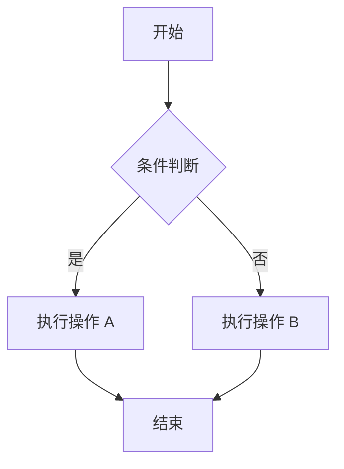
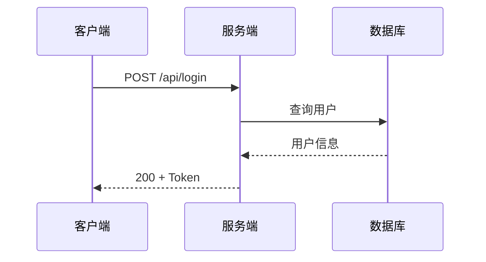
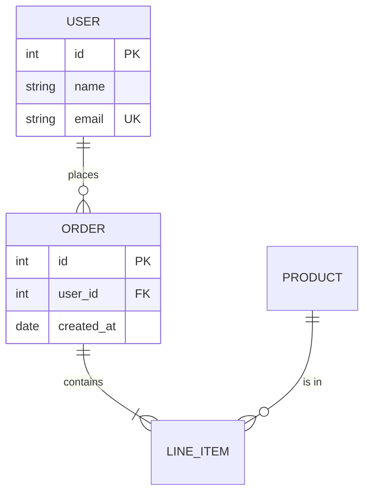
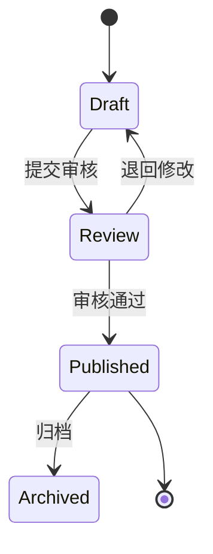
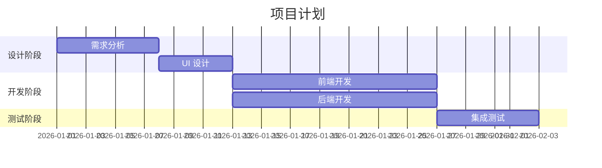
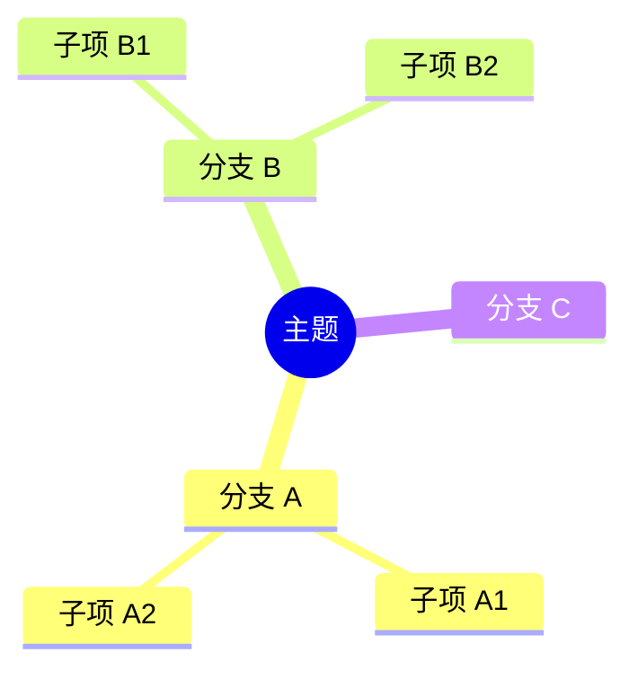
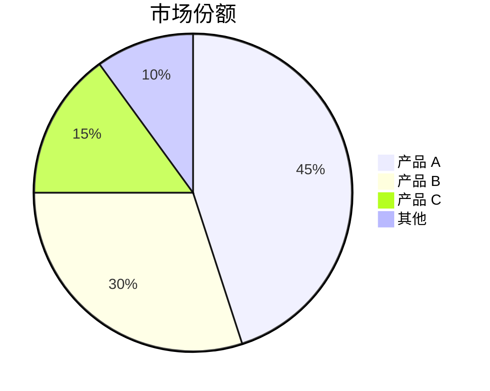

# Mermaid 引擎

从文章内容生成 Mermaid 图表。

## 工具依赖

```bash
# 安装 Mermaid CLI (渲染模式需要)
npm install -g @mermaid-js/mermaid-cli

# 验证
mmdc --version
```

内联模式 (```mermaid 代码块) 不需要安装任何工具。

## 输出模式

| 模式 | 环境变量 | 说明 |
|------|---------|------|
| inline (默认) | `VISUALIZE_MERMAID_MODE=inline` | 输出 Mermaid 代码块，平台渲染 |
| render | `VISUALIZE_MERMAID_MODE=render` | mmdc 渲染为 PNG/SVG 文件 |

微信公众号、邮件等不支持 Mermaid 的平台自动切换 render 模式。

### 渲染命令

```bash
# PNG
mmdc -i input.mmd -o output.png -t neutral -w 1200

# SVG
mmdc -i input.mmd -o output.svg -t neutral

# 指定背景色 (白色，适配更多平台)
mmdc -i input.mmd -o output.png -t neutral -b white
```

## 图表类型与模板

### 流程图 (flowchart)

适用: 步骤、决策、分支逻辑



**生成要点**:
- 用 TD (上→下) 或 LR (左→右)，根据步骤数量选择方向
- 步骤数 ≤5 用 LR，>5 用 TD
- 节点文字简短 (≤8 个字)
- 决策点用菱形 `{}`
- 关键路径加粗或变色

### 时序图 (sequenceDiagram)

适用: API 调用链、系统交互、请求/响应



**生成要点**:
- participant 用简短别名
- 实线箭头 `->>` 表示请求，虚线 `-->>` 表示响应
- 参与者不超过 5 个，多了拆分
- 加 Note 标注关键逻辑

### ER 图 (erDiagram)

适用: 数据模型、表结构



**生成要点**:
- 关系符号: `||` 一对一, `o{` 零或多, `|{` 一或多
- 标注 PK/FK/UK
- 字段类型简写

### 状态图 (stateDiagram-v2)

适用: 状态机、生命周期



### 甘特图 (gantt)

适用: 项目计划、时间线



### 思维导图 (mindmap)

适用: 概念整理、知识结构



### 饼图 (pie)

适用: 数据占比



## 生成规则

1. **从文章提取数据**: 扫描段落中的实体、关系、步骤，构建图表结构
2. **中文优先**: 节点标签用中文 (除非文章是英文)
3. **简洁**: 每个图表不超过 15 个节点，超过则拆分
4. **颜色**: 默认使用 neutral 主题，不额外加样式 (保持干净)
5. **代码块格式**:
   - 内联模式: 直接插入 ````mermaid ... ```` 代码块
   - 渲染模式: 先写 .mmd 临时文件 → mmdc 渲染 → 删除临时文件

## 常见错误

| 错误 | 修复 |
|------|------|
| 节点文字含特殊字符 | 用引号包裹: `A["含(括号)的文字"]` |
| 中文箭头标签乱码 | 确保文件 UTF-8 编码 |
| 图表太大看不清 | 拆分为多个小图，或用 `-w 2400` 增大宽度 |
| mmdc 报错 | 检查 Node.js 版本 ≥18，重装 mermaid-cli |
